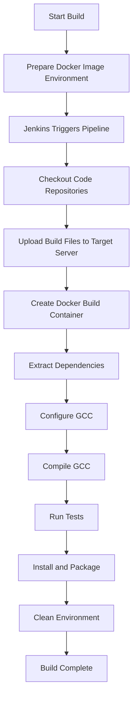

# GCC CI/CD Pipeline Documentation

## Overview

This document provides a comprehensive introduction to a complete CI/CD pipeline implementation for the GCC compiler project. The solution leverages Jenkins as the pipeline orchestration tool and implements cross-platform standardized build environments through Docker containerization technology, supporting automated builds of GCC across multiple Linux distributions.

## Architecture Design

### Overall Architecture

The CI/CD pipeline adopts a layered architecture design, consisting of three core components. The complete directory structure is as follows:

```
GCC CI/CD
├── osscicd/gcc (Jenkins Pipeline Control Layer)
│   ├── Jenkinsfile                                                          # Main pipeline definition file
│   ├── stage.upload.script.groovy                                           # File upload stage script
│   ├── build-gcc-15-on-*.cicd.sh                                            # Docker container build control scripts
│   ├── Dockerfile                                                           # Build environment image definition
│   ├── README.md
│   └── LICENSE
│
├── ossscripts/gcc (Build Script Execution Layer)
│    ├── build-gcc-15-on-*.build.sh                                          # Actual compilation build scripts
│    ├── README.md
│    └── LICENSE
│
└── ossimages/gcc (Docker Image Environment Layer)
    ├── keep-gcc-images-up-to-date.sh                                        # Image maintenance and update script
    ├── README.md
    └── LICENSE
```

### Component Responsibilities

1. **Jenkins Pipeline Control Layer** (`CICD`)
   - Responsible for orchestrating and controlling the entire build process
   - Manages build parameters and environment variables
   - Coordinates the execution of various build stages

2. **Build Script Execution Layer** (`Scripts`)
   - Contains the actual compilation and build logic
   - Handles dependency library management and version control
   - Implements compilation optimizations and patch applications

3. **Docker Image Environment Layer** (`Images`)
   - Provides standardized compilation environments
   - Maintains base images for multiple Linux distributions
   - Ensures consistency and reproducibility of build environments

## Core Components Details

### 1. Docker Image Environment Layer

**Repository Location**: [https://github.com/ossimages/gcc.git](https://github.com/ossimages/gcc.git)

**Script Location**: `keep-gcc-images-up-to-date.sh`

**Main Functions**:
- Maintains base images for multiple Linux distributions
- Automatically updates and optimizes images, installing required compilation dependencies
- Generates single-layer optimized images to reduce image size

**Supported Linux Distributions**:
- AlmaLinux 9, 10
- CentOS Stream 9, 10
- Oracle Linux 9, 10
- Rocky Linux 9, 10
- Ubuntu 22.04, 24.04
- Debian 12, 13

**Workflow**:
1. Pull official base images and re-tag them
2. Create and start containers
3. Execute appropriate updates and dependency installations based on distribution type (Debian/RHEL)
4. Install development tools and libraries required for GCC compilation
5. Clean cache and temporary files
6. Export containers as single-layer images
7. Save image files for subsequent use

### 2. Jenkins Pipeline Control Layer

**Repository Location**: [https://github.com/osscicd/gcc.git](https://github.com/osscicd/gcc.git)

**Main Files**:
- `Jenkinsfile`: Main pipeline definition file
- `stage.upload.script.groovy`: File upload stage script
- `build-gcc-{major-version}-on-*.cicd.sh`: Docker container build control scripts (multi-distribution support)
- `Dockerfile`: Build environment image definition

**Pipeline Stages**:

1. **Checkout Stage**
   - Check out CI/CD code repository
   - Check out GCC source code repository
   - Switch to specified version tag

2. **Upload Stage**
   - Dynamically replace version parameters in scripts
   - Upload build scripts to target server
   - Upload GCC source package
   - Upload pre-compiled packages of all dependencies

3. **Configure Stage**
   - Execute configure in Docker container
   - Apply necessary patches if needed

4. **Make Stage**
   - Execute parallel compilation

5. **MakeTest Stage**
   - Run test cases

6. **MakeInstall Stage**
   - Install compilation artifacts
   - Package binary files

7. **Cleanup Stage**
   - Clean temporary files and containers

### 3. Build Script Execution Layer

**Repository Location**: [https://github.com/ossscripts/gcc.git](https://github.com/ossscripts/gcc.git)

**Core Scripts**: `build-gcc-{major-version}-on-*.build.sh` (supports multiple distributions)

**Main Functions**:
- Actually executes GCC compiler compilation and building
- Manages dependency library extraction and configuration
- Handles compilation parameters and optimization options
- Applies necessary patch fixes

**Key Features**:

1. **Multi-Architecture Support**
   - Automatically detects and supports x86_64, aarch64, and other architectures
   - Optimizes compilation parameters for different architectures

2. **Compilation Optimizations**
   
   The following flags are commonly used to enhance security and performance when building C/C++ projects:
   
   ```sh
   export CPPFLAGS="-DNDEBUG -D_FORTIFY_SOURCE=2"
   export CFLAGS="-O2 -g1 -fstack-protector-strong -fPIC -flto"
   export CXXFLAGS="-O2 -g1 -fstack-protector-strong -fPIC -flto"
   export LDFLAGS="-Wl,-z,relro -Wl,-z,now -Wl,-z,noexecstack -Wl,--as-needed -flto"
   ```
   
   **Warning:**
   Do **not** set these environment variables globally when building GCC from source. GCC's build system performs multi-stage bootstrap builds and expects to control its own build flags. Setting these variables globally (via `export` or in the environment) can cause build failures, miscompilations, or broken toolchains. For GCC itself, let the build system manage its own flags. If you need to customize the build, use the appropriate `configure` options or patch the build scripts, but avoid global environment overrides.

3. **Dependency Management**
   - Supports version management for GMP, MPFR, MPC, and other mathematical libraries
   - All dependencies are pre-compiled to accelerate the build process

## Workflow

### Complete Build Process



### Parameterized Build

The pipeline supports the following parameters:
- `GCC_VERSION`: GCC version (e.g., 15.1.0-ubuntu-24.04)
- `GIT_BRANCH`: Git branch name
- `LINUX_IP_ADDRESS`: Target build server IP
- `LINUX_SSH_PORT`: SSH port
- `GIT_CREDENTIALS_ID`: Git credentials ID
- `GIT_URL`: Git repository URL
- `LINUX_ROOT_PASSWORD`: Root password for target server

## Technical Features

### 1. Containerized Build Environment

- Uses Docker to ensure build environment consistency
- Supports parallel builds across multiple Linux distributions
- Image optimization techniques reduce storage space

### 2. High Degree of Automation

- Fully automated process from environment preparation to final packaging
- Automatic dependency handling
- Automatic application of necessary patches

### 3. Strong Scalability

- Easy to add support for new Linux distributions
- Modular design facilitates maintenance and extension
- Parameterized configuration supports different version builds
- Can be extended to Windows, macOS, and other operating systems as needed

### 4. Security Considerations

- Uses MaskPasswordsBuildWrapper to protect sensitive information
- Enables security hardening options during compilation
- Cleans temporary files during the build process

## Usage Guide

### Prerequisites

1. Jenkins environment configured
2. Docker environment ready
3. Target build server accessible
4. Git repository access permissions configured

### Triggering a Build

1. Create a parameterized build job in Jenkins
2. Configure necessary parameters (version, target server, etc.)
3. Trigger the build job
4. Wait for build completion and retrieve artifacts

### Build Artifacts

After build completion, the following artifacts are generated:
- GCC compiler binary package: `gcc-{version}.{distribution}.binary-{timestamp}.tar.gz`
- Complete installation package including all dependencies

## Maintenance Recommendations

### Regular Updates

1. **Base Image Updates**
   - Recommend running the `keep-gcc-images-up-to-date.sh` script monthly
   - Keep system packages and security patches up to date

2. **Dependency Version Management**
   - Regularly check for new versions of dependencies
   - Test compatibility of new versions

3. **Patch Management**
   - Track upstream project updates
   - Evaluate whether to update or remove existing patches

### Troubleshooting

1. **Build Failures**
   - Check Jenkins build logs
   - Verify Docker container status
   - Confirm network connectivity

2. **Dependency Issues**
   - Check if dependency files exist
   - Verify version compatibility
   - Review configure logs

3. **Performance Optimization**
   - Use parallel compilation to accelerate builds
   - Optimize Docker image size
   - Consider using build cache

## Platform Extension Capabilities

### Currently Supported Platforms

The CI/CD pipeline currently supports 12 mainstream Linux distributions, covering the most commonly used operating systems in enterprise production environments.

### Cross-Platform Extension Potential

The pipeline architecture has excellent extensibility and can be extended to other operating systems based on actual work requirements:

1. **Windows Platform**
   - Can be implemented through Windows containers or WSL2
   - Adapt to Visual Studio compilation toolchain
   - Support generating Windows native binaries

2. **macOS Platform**
   - Can be implemented through macOS build agents
   - Adapt to Xcode and Homebrew toolchains
   - Support generating Universal Binary

3. **Other Unix-like Systems**
   - BSD series like FreeBSD, OpenBSD
   - Commercial Unix like Solaris, AIX
   - Embedded Linux distributions

### Extension Implementation Strategy

1. **Evaluate Requirements**: Decide whether to extend based on actual project needs
2. **Environment Adaptation**: Adjust compilation environment and dependencies for target platform
3. **Script Porting**: Modify build scripts to accommodate platform characteristics
4. **Test Validation**: Ensure build quality on new platforms

## Summary

This GCC CI/CD pipeline solution achieves the following through the organic combination of Jenkins, Docker, and automated scripts:

1. **Standardization**: Unified build environment and process
2. **Automation**: Fully automated execution throughout the process
3. **Repeatability**: Ensures consistency of build results
4. **Extensibility**: Easy to add new platform support, extendable to Windows, macOS, and other systems
5. **High Efficiency**: Parallel builds and pre-compiled dependencies
6. **Wide Coverage**: Supports 12 mainstream Linux distributions, can be extended as needed

This solution is not only suitable for building GCC compiler on multiple Linux distributions but also has the capability to extend to other operating systems. Through containerization technology and automated processes, it reduces the maintenance cost of build environments and improves build reliability and flexibility.

## Appendix

### Related Links

- GCC Official Repository: https://gcc.gnu.org/git/gcc.git
- Jenkins Official Documentation: https://www.jenkins.io/doc/
- Docker Official Documentation: https://docs.docker.com/
- CICD Repository: [https://github.com/osscicd/gcc.git](https://github.com/osscicd/gcc.git)
- Scripts Repository: [https://github.com/ossscripts/gcc.git](https://github.com/ossscripts/gcc.git)
- Images Repository: [https://github.com/ossimages/gcc.git](https://github.com/ossimages/gcc.git)
